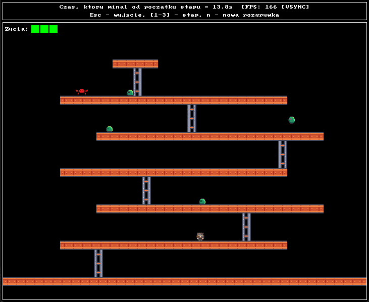

# donkey-kong-cpp

A Donkey Kong-inspired arcade platformer built in C++ with SDL2.

Climb a multi-floor building, dodge rolling barrels, and reach the top.

---

## Controls

| Key | Action |
|-----|--------|
| Arrow keys | Move / climb ladders |
| Space | Jump |
| N | New game |
| Esc | Quit |

Number keys `1`–`3` switch levels directly (for demo purposes).

## Features

- 3 levels with platforms, ladders, and rolling barrels
- Physics-based jumping with gravity and fall-off-edge behavior
- Barrel collision detection and lives system
- Main menu and death/continue screen
- Run, jump, climb, and barrel animations (frame-rate independent)

## Notes

- No C++ STL used - project constraint
- All constants (speed, gravity, jump height, etc.) are defined at the top of `main.cpp` for easy tuning

*Basics of Programming 2023/24*
